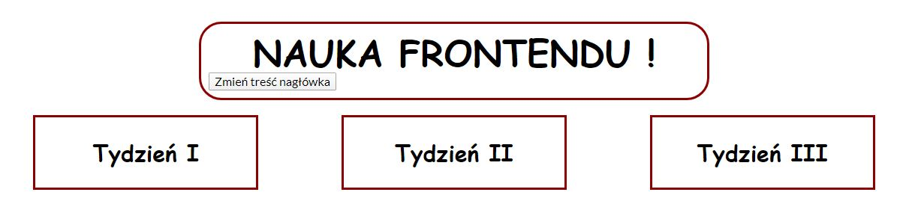

# Mój Homepage

Zapraszam na moją stronę [Strona domowa](https://michalfrelik.github.io/homepage-gulp/)

## Jak uruchomić stronę lokalnie

Aby uruchomić strobę lokalnie wykonaj poniższe polecenia:

`npm install -g gulp-cli`

`npm install`

`gulp`

To publish your page using github pages use `npm run deploy`
